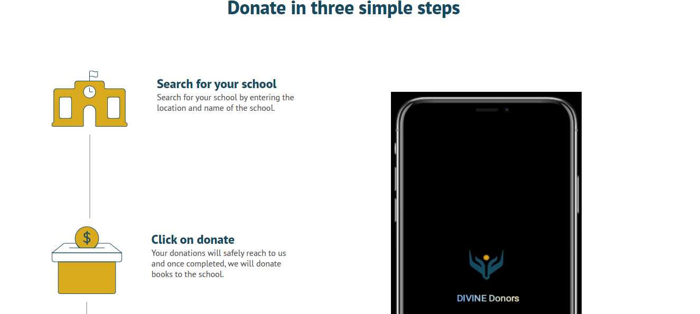
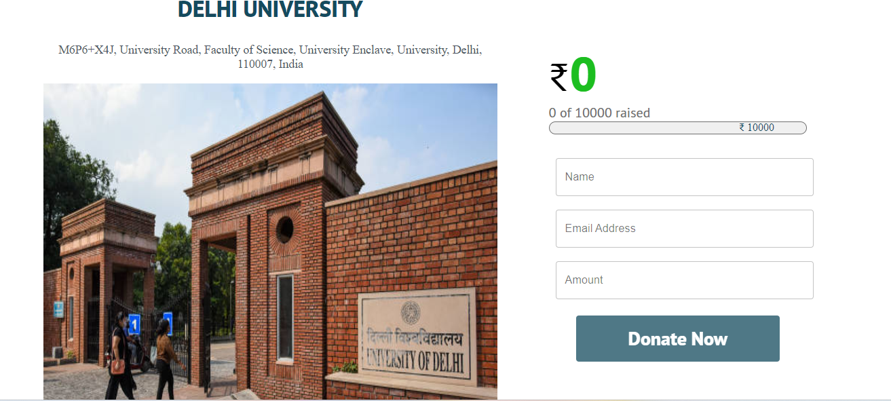
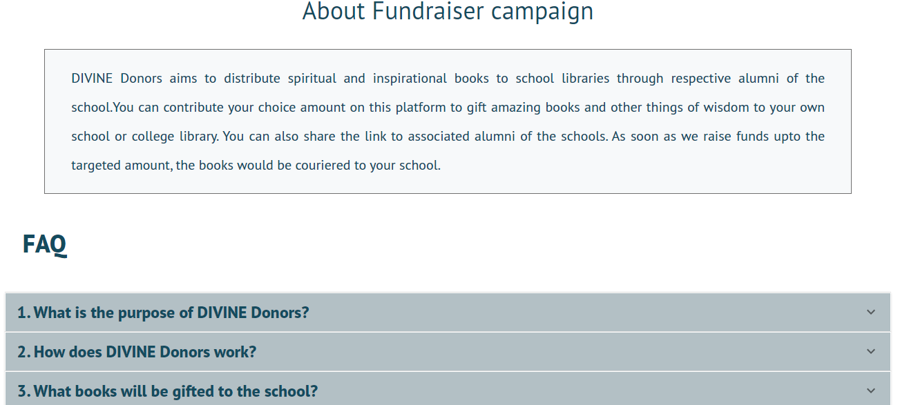

# Divine Donors Crowdfunding Platform

## Problem Statement

Schools often lack access to spiritual wisdom literature, which is vital for instilling a healthy pride in native culture and heritage among students. Alumni and well-wishers may wish to contribute to their schools but lack an organized platform to do so effectively.

## Solution

Divine Donors is a crowdfunding platform designed to bridge this gap by enabling alumni to find their schools and sponsor spiritual literature as a gesture of gratitude. This platform facilitates the creation and sharing of campaigns, making it easy to raise funds and spread awareness.

## Mission

Our mission is to ensure that every school library is enriched with spiritual wisdom literature. We aim to foster a deeper understanding and appreciation of native culture and heritage among students.

## Effects

- Increased availability of spiritual wisdom literature in school libraries.
- Enhanced understanding and appreciation of native culture among students.
- Strengthened alumni connections and contributions to their alma maters.

## Technical Description

### Platform Structure and Functionality

- **User-Friendly Interface**: Designed for both fundraisers and supporters, allowing easy campaign creation and contribution.
- **Campaign Features**: Includes tools for campaign creation, payment processing, social sharing, and communication.

### Payment Processing

- **Secure Transactions**: Integrates with popular payment gateways like Razorpay to ensure secure and efficient transactions.

### Social Media Integration

- **Built-in Sharing Tools**: Enables easy sharing of campaigns on social media platforms like Facebook and Twitter to reach a wider audience.

### Notable Features

- **School Search**: Utilizes Google Maps JavaScript API to facilitate school searches.
- **Payment Integration**: Razorpay service integrated for collecting donations.
- **App Migration**: Migrated from React.js to Next.js for improved performance and scalability.
- **API Development**: Built RESTful APIs using Node.js, Express.js, and MongoDB for the Volstory app.

## Future Work and Technological Evolution

- **Enhanced User Experience**: Continuously improve the user interface and experience based on user feedback.
- **Expanded Payment Options**: Integrate additional payment gateways to cater to a global audience.
- **Mobile App Development**: Develop mobile applications to increase accessibility and engagement.
- **Advanced Analytics**: Implement advanced analytics tools to provide better insights and reporting for campaign performance.
- **AI Integration**: Leverage AI for personalized campaign recommendations and fraud detection.
- **Advanced Algorithms**: Add advanced algorithms for recommendation purposes.
- **Blockchain Migration**: Migrate the Next.js application to a blockchain application using Solidity.

Feel free to explore the code, contribute, or provide feedback to help us improve Divine Donors.
